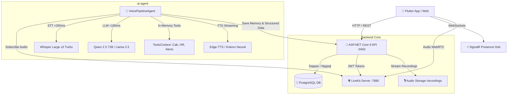

# 🚀 PruvaVoice Core API & Autonomous AI Voice Agent

[](https://dotnet.microsoft.com/)
[](https://docs.microsoft.com/en-us/dotnet/csharp/)
[](https://www.postgresql.org/)
[](https://livekit.io/)
[](https://groq.com/)
[]()

An enterprise-grade, high-concurrency voice communication and autonomous AI calling backend. Combines an ultra-fast **ASP.NET Core 9 Minimal API** with an embedded **Python LiveKit Voice Agent Worker** powered by Groq LPUs and Edge-TTS neural speech synthesis.

---

## 🏛️ System Architecture



---

## ✨ Key Features

### 1. ASP.NET Core 9 Minimal API (`hello_api`)
- **Lightning Performance**: Built with C# 13 and .NET 9 Minimal APIs using **Dapper** micro-ORM for ultra-low database overhead.
- **WebRTC Token Generation**: Secure JWT LiveKit token dispenser with configurable room permissions, role grants, and participant metadata.
- **SignalR Signaling**: Real-time incoming call alerts, call status tracking (`ringing`, `connected`, `ended`), and live host availability.
- **Audio Streaming (`HTTP 206 Partial Content`)**: Stream dual-track `.wav` recordings directly to mobile and web players with instant seek support.
- **Dynamic Payments & UPI Manual Recharge**: Supports instant payment gateway fallback and direct UPI QR recharges with UTR verification and receipt image upload.

### 2. Autonomous Multi-Persona AI Voice Agent (`ai-agent/`)
- **Sub-220ms Latency Pipeline**:
  - **STT**: `whisper-large-v3-turbo` via Groq LPU (~250ms).
  - **LLM**: `qwen/qwen3.8-27b` / `llama-3.3-70b-versatile` with automatic circuit-breaker failover to `llama-3.1-8b-instant`.
  - **TTS**: LRU in-memory cached Edge-TTS streaming (~0ms replay for repeated phrases).
  - **VAD & Interruption**: Silero VAD with `0.18s` interruption threshold and `0.22s` endpointing delay.
- **In-Memory Session Tool Engine (`tools_context.py`)**:
  - `estimate_cab_fare(pickup, drop, cab_type)`: Live distance heuristic and modular rate card calculation in memory.
  - `book_cab_ride(...)`: Allocates Driver, Vehicle Number, OTP, and ETA in session memory without intermediate database latency.
  - `save_hr_candidate_evaluation(...)`: Logs screening questions, CTC, notice period, and 1-10 scores in memory.
  - `trigger_parent_emergency_alert(...)`: High-priority alert dispatcher for elderly care distress symptoms.
- **Single End-of-Call Structured Payload**: Consolidated structured JSON payload dispatched once upon call termination to PostgreSQL `ai_call_structured_data`.
- **7 Trained Domain Personas**:
  1. 🚖 **Cab Booking Assistant**: Real rate card, live fare quotes, and autonomous driver allocation.
  2. 💼 **HR Job Screening Specialist**: Candidate screening, skills evaluation, and structured profiling.
  3. 🎯 **HR Job Interviewer**: Mock interviews using STAR framework.
  4. 🧸 **Kids Learning Buddy**: Playful animal sound cues (*"Roaaar!"*, *"Whooosh!"*), rhymes, and interactive riddles.
  5. 💖 **Romantic Companion**: Empathic, sweet, and caring companion with memory recall.
  6. 🌿 **Parents Care Assistant**: Respectful elder care companion with emergency alert trigger.
  7. 🗣️ **Spoken English Coach**: Gentle grammar corrections and conversational fluency builder.

---

## 📁 Repository Structure

```
hello_api/
├── Endpoints/
│   ├── AdminEndpoints.cs           # Admin dashboard metrics, user calls & telemetry
│   ├── AdminSettingsEndpoints.cs   # Global app configuration & AI visibility
│   ├── AiCallEndpoints.cs          # AI sessions, memory recall & structured data
│   ├── AuthEndpoints.cs            # Phone OTP authentication & JWT issuance
│   ├── CallEndpoints.cs            # P2P call sessions, host connection & billing
│   ├── HostEndpoints.cs            # Host profile management & rates
│   ├── PaymentEndpoints.cs         # Payment gateway integration
│   ├── UpiRechargeEndpoints.cs     # Manual UPI recharge requests & receipt uploads
│   ├── UserEndpoints.cs            # User profiles & wallet balance
│   └── WalletEndpoints.cs          # Payouts & ledger transactions
├── Services/
│   ├── LiveKitTokenService.cs      # LiveKit JWT token generator
│   └── PresenceSchedulerWorker.cs  # SignalR host heartbeat & presence worker
├── ai-agent/                       # 🤖 Bundled Autonomous Python Voice Agent
│   ├── personas/                   # 7 modular persona system prompts & configs
│   ├── agent.py                    # Main LiveKit VoicePipelineAgent worker
│   ├── tools_context.py            # LiveKit FunctionContext in-memory tool engine
│   ├── llm_orchestrator.py         # Multi-engine Groq failover & memory builder
│   ├── edge_tts_wrapper.py         # In-memory cached Edge-TTS adapter
│   ├── tts_factory.py              # Multi-engine TTS switch (Edge / Kokoro / Sarvam)
│   ├── requirements.txt            # Python dependencies
│   └── .env.example                # Agent environment template
├── Program.cs                      # App startup, DI configuration & middleware
├── PruvaVoice.Api.csproj           # .NET 9 Project File
└── appsettings.json                # Connection strings & JWT secret
```

---

## 🔌 API Endpoints Reference

### AI Calling & Memory (`/api/ai/*`)
| Method | Endpoint | Description |
| :--- | :--- | :--- |
| `GET` | `/api/ai/options` | Returns active personas, voice engines, and supported languages |
| `POST`| `/api/ai/start` | Creates call session & generates LiveKit token for user |
| `GET` | `/api/ai/memory` | Retrieves user's past call memory summary & recent turns |
| `POST`| `/api/ai/memory/save` | Updates user conversation memory profile |
| `POST`| `/api/ai/calls/{id}/structured-data` | Ingests end-of-call structured tool payload (Cab / HR) |
| `GET` | `/api/ai/calls/my-history` | User's AI call history with duration and recording link |
| `GET` | `/api/ai/recordings/{filename}` | Streams dual-track `.wav` audio recording with range requests |

### P2P Calling & Signaling (`/api/calls/*`)
| Method | Endpoint | Description |
| :--- | :--- | :--- |
| `POST`| `/api/calls/start` | Initiates call to a host, triggers ringback & SignalR alert |
| `POST`| `/api/calls/{id}/accept`| Host accepts call, binds LiveKit room |
| `POST`| `/api/calls/{id}/end` | Finalizes call, calculates per-minute billing & updates wallet |
| `GET` | `/api/calls/history` | Returns user call logs |

---

## 🚀 Getting Started

### Prerequisites
- [.NET 9.0 SDK](https://dotnet.microsoft.com/download/dotnet/9.0)
- [PostgreSQL 14+](https://www.postgresql.org/)
- [Python 3.10 - 3.12](https://www.python.org/) (for `ai-agent`)
- [LiveKit Server](https://livekit.io/) running locally or in cloud

### 1. Setup & Run .NET API
```bash
cd hello_api

# Update appsettings.json with your PostgreSQL connection string:
# "DefaultConnection": "Host=localhost;Database=pruva_voice;Username=postgres;Password=yourpassword"

# Restore dependencies & run
dotnet restore
dotnet run --urls "http://0.0.0.0:5063"
```
The API will start on **`http://localhost:5063`**. Database tables are auto-migrated on first boot!

### 2. Setup & Run AI Voice Agent
```bash
cd hello_api/ai-agent

# Create virtual environment
python -m venv venv
venv\Scripts\activate      # Windows
# source venv/bin/activate # macOS/Linux

# Install dependencies
pip install -r requirements.txt

# Configure environment
cp .env.example .env
# Fill in your LIVEKIT_URL, LIVEKIT_API_KEY, LIVEKIT_API_SECRET, and GROQ_API_KEY

# Start AI Voice Agent Worker in dev mode
python agent.py dev
```
The voice agent will connect to LiveKit and register as an active room worker listening for calls!

---

## 🛡️ License
Private & Proprietary. All Rights Reserved.
